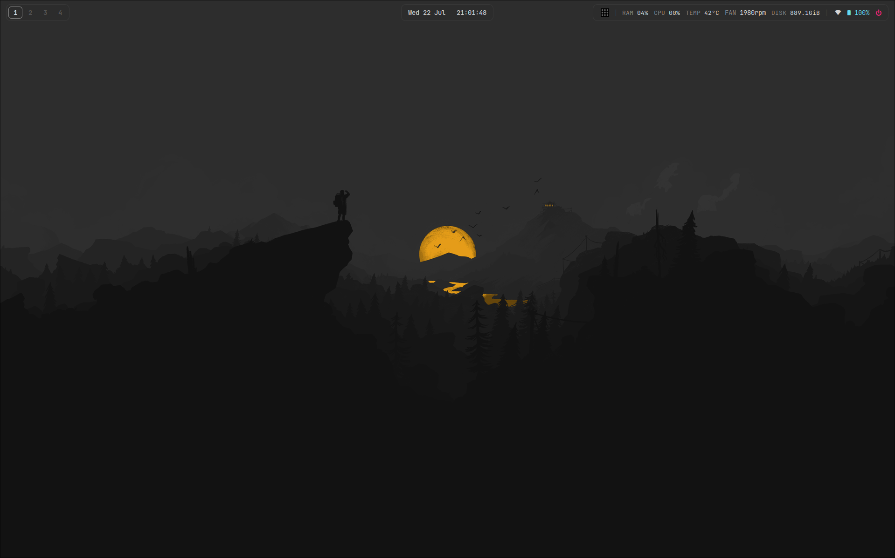
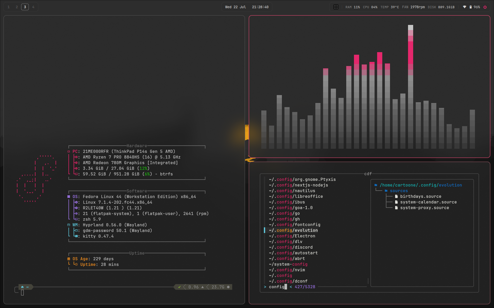
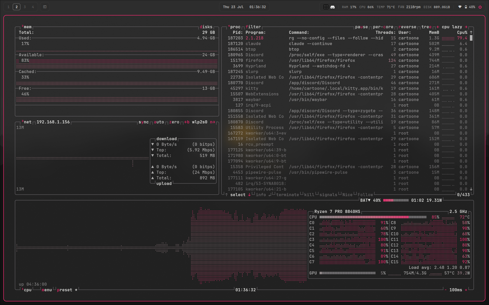
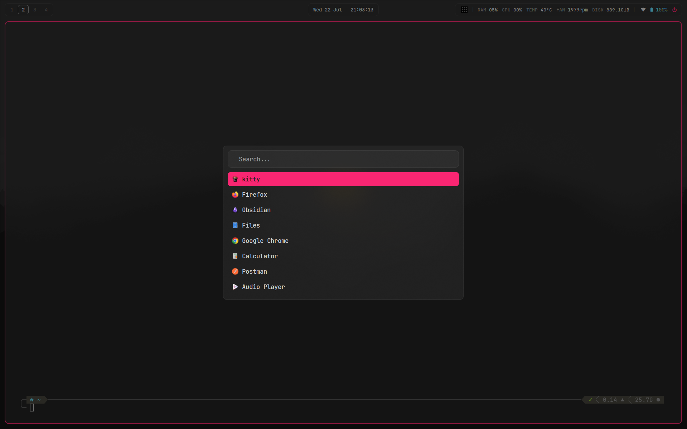
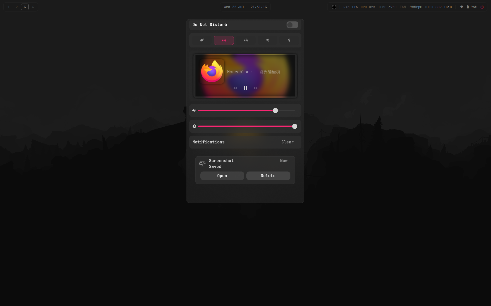
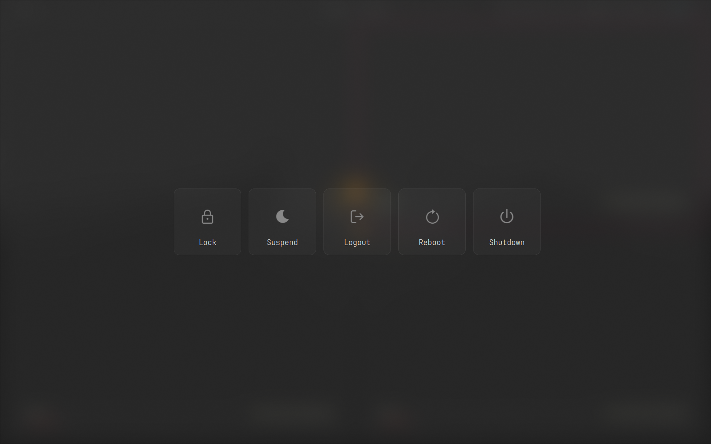
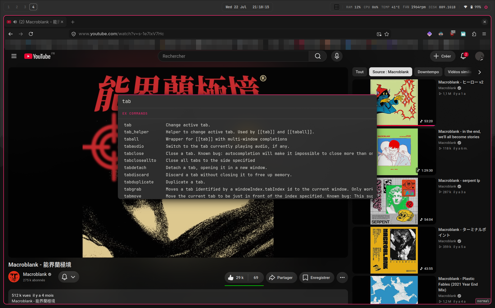
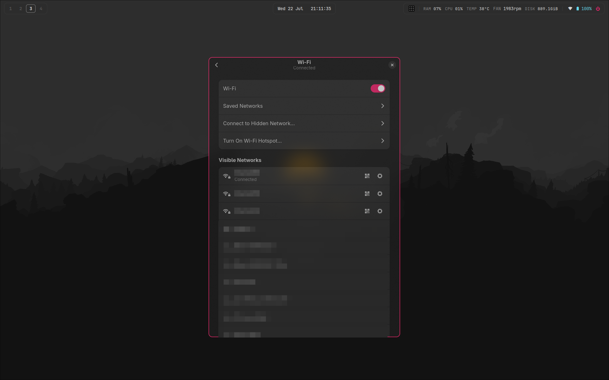

<div align="center">

# dotfiles

**Monokai-themed Hyprland setup on Fedora 44**, daily driven on a ThinkPad P14s Gen 5 (AMD).


[Install](#install) ·
[Gallery](#gallery) ·
[Keybinds](#keybinds) ·
[Highlights](#highlights) ·
[Footprint](#footprint) ·
[Dependencies](#dependencies) ·
[Credits](#credits)

<!-- intro video goes here -->



</div>

## What's in here

| Role | Tool |
|---|---|
| Compositor | [Hyprland](https://hyprland.org/), Lua config provider build, configured in `.config/hypr/lua/` |
| Bar | Waybar |
| Notifications | SwayNC |
| Launcher | Rofi 2.0: app launcher, emoji picker, wifi/bluetooth menus |
| Terminal | kitty |
| Lock / idle | hyprlock / hypridle |
| Logout menu | wlogout, with an optional patch for a single hover/focus overlay (`.config/wlogout/patches/`) |
| Wallpaper | swww, set at login by `hypr/scripts/WallpaperDaemon.sh` |
| Shell | zsh + oh-my-zsh + powerlevel10k, atuin, zoxide, eza, fzf + fd |
| Theming | Monokai everywhere, accent `#F92672`: GTK 3/4, Qt (qt5ct/qt6ct + Kvantum), tridactyl, btop |

> [!IMPORTANT]
> The Hyprland config is written in Lua and needs the Lua config provider build
> from COPR [`sdegler/hyprland`](https://copr.fedorainfracloud.org/coprs/sdegler/hyprland/).
> It will not parse on stock Hyprland.

## Install

```sh
git clone https://github.com/Cartoone9/dotfiles ~/dotfiles
~/dotfiles/install.sh               # full bootstrap
~/dotfiles/install.sh --links-only  # just the symlinks
```

The full bootstrap asks which wifi menu you want (GNOME panel or rofi script,
the prompt explains the trade-off), which main modifier you prefer (ALT or
SUPER), and your git name and email, enables the three COPRs, installs the
dependencies plus the Nerd Font and the zsh stack, then symlinks everything
into place.

> [!NOTE]
> Real files the installer would replace are moved aside to `*.bak`. Existing
> *symlinks* are repointed without a backup, on the assumption they came from
> a previous run of this script — if you already manage your dotfiles another
> way, back up `~/.config` yourself first. The tracked `.gitconfig` carries no
> identity: it includes
> `~/.gitconfig.local`, which the installer creates from a name and email it
> asks you for. The package step is Fedora only (`dnf`); on other distros run
> `--links-only` and install the [dependency list](#dependencies) yourself.

**Layout:** the repo mirrors `$HOME` — `.zshrc`, `.p10k.zsh`, etc. at the root
and one directory per app under `.config/`. Everything on the machine is a
symlink into this repo, so a `git pull` updates the live config. systemd user
units live in `.config/systemd/user` with their `wants/` enablement symlinks
tracked (relative, so they resolve for any user), so they come pre-enabled.

If you answer the SUPER or rofi-wifi prompts, the installer edits
`binds.lua` and `config.jsonc` in place, so your clone will show those two
files as modified. That is expected; commit them on your own branch or keep
them as a local diff.

## Gallery

<details open>
<summary><b>Terminal</b> — kitty + zsh + powerlevel10k, fastfetch, cava, and the <code>cdf</code> fuzzy directory picker</summary>



</details>

<details>
<summary><b>btop</b> — a custom Monokai theme: the neutral greys nvim uses, the <code>#F92672</code> accent, and a grey→red load gradient tuned to stay readable at any load</summary>



</details>

<details>
<summary><b>Launcher</b> — Rofi with the Monokai accent</summary>



</details>

<details>
<summary><b>Notifications</b> — SwayNC control center: media player, radio toggles, volume and brightness sliders</summary>



</details>

<details>
<summary><b>Logout</b> — wlogout with the optional single hover/focus overlay patch</summary>



</details>

<details>
<summary><b>Firefox</b> — tridactyl with the Monokai theme from <code>.config/tridactyl/themes</code></summary>



</details>

The wifi popup gets [its own section](#the-wifi-menu-trick) below.

## Keybinds

This config uses **ALT** as the main modifier, not SUPER: window management
lives on ALT, helpers (screenshots, power menu, layout switching...) live on
SUPER. Not your taste? It is one variable at the top of
`.config/hypr/lua/binds.lua`: set `mainMod` to `"SUPER"` and the helper binds
swap to ALT automatically, with no collisions. `install.sh` also asks which
one you want.

The essentials, with the default ALT:

| Keys | Action |
|---|---|
| `ALT + Space` | app launcher (rofi) |
| `ALT + Q` | close window |
| `ALT + F` | hide other windows (maximize toggle) |
| `ALT + SHIFT + F` | fullscreen |
| `ALT + Tab` | cycle windows |
| `ALT + Z` | wifi menu |
| `SUPER + Escape` | power menu (wlogout) |
| `SUPER + Backspace` | lock screen |
| `SUPER + Shift` | area screenshot (swappy) |
| `SUPER + E` | emoji picker |
| `SUPER + 1 / 2 / 3` | layout: dwindle / master / scrolling |
| `SUPER + H` | searchable list of all keybinds (rofi) |

There are about a hundred binds total. `SUPER + H` opens a searchable rofi
menu generated from `binds.lua` descriptions, so the config itself is the
documentation.

## Highlights

Things this config does that you won't find in the average Hyprland starter.

### The wifi menu trick

Clicking the network module in Waybar opens the actual GNOME Settings Wi-Fi
panel as a floating window (`waybar/scripts/wifi-settings.sh`):

- `gnome-control-center` refuses to start when `XDG_CURRENT_DESKTOP` is not
  GNOME, so the script spoofs it for that process only:
  `env XDG_CURRENT_DESKTOP=GNOME gnome-control-center wifi`
- a Hyprland window rule floats it centered at `600x880`. Below 600 px wide
  the libadwaita sidebar collapses, leaving a clean wifi-only popup
- you keep everything the panel does natively: live rescan, password
  dialogs, captive portals
- ESC closes it (the keybind only exists while the window is focused), and
  clicking the module again toggles it away



No GNOME? `waybar/scripts/rofi-wifi.sh` is a self-contained nmcli + rofi wifi
menu (scan, connect, forget, hidden SSID) with no GNOME dependency.
`install.sh` asks which one you want, then points both the Waybar click and
the `mainMod + Z` / `auxMod + grave` keybinds at your choice.
If `gnome-control-center` is already installed it goes with the GNOME panel
without asking. `networkmanager_dmenu` (installed by `install.sh`, themed via
`rofi/config-wifi.rasi`) is a third option.

### Hidden-window indicator

ALT+F maximizes the focused window ("hide other windows"). When something is
maximized, a bar module shows one icon per window sitting underneath it;
ALT+Tab or a click on the module cycles through them. The module vanishes
when nothing is maximized. It listens on Hyprland's socket2 instead of
polling, coalesces event bursts, and only re-emits when the output actually
changes (`waybar/scripts/hidden-window.sh`).

### Event-driven bar modules

The network and battery modules are not polled. Each is a script that runs
once and streams JSON to Waybar:

- battery wakes on `power_supply` udev events, so plugging or unplugging the
  charger updates the bar at kernel speed instead of after upowerd's settle
  lag. Values are read from sysfs, with a 30s refresh for the drain rate
  (`battery-status.sh`)
- network wakes on NetworkManager events (bursts debounced) and reads SSID
  and signal strength from `iw`, live kernel values, because nmcli's scan
  cache can be minutes old. Also covers the VPN, wifi-off, and airplane
  states (`network-vpn.sh`)
- a small systemd user service (`rfkill-css-sync.service`) watches
  `rfkill event` and keeps the swaync airplane and bluetooth toggles in sync
  no matter what changed the state: GNOME Settings, nmcli, the Fn key, or a
  hardware switch (`hypr/scripts/rfkill-watch.sh`)

### Two-tier lock and suspend timings

`hypridle.conf` behaves differently depending on whether the session is
already locked. Unlocked and idle: lock at 10 min, screen off at 10.5,
suspend at 11. Already locked (you locked it yourself and walked away):
screen off after 10 seconds, suspend after 1 minute. Locking manually is
the signal that you're gone, so the machine doesn't sit there lit and
awake for another ten minutes. Suspend always locks first
(`before_sleep_cmd`).

### wlogout, patched and adaptive

`Wlogout.sh` reads the focused monitor's logical size and computes square
buttons from it (a quarter of the screen height, clamped to 120-200 px),
centered as a row, with a fallback for narrow screens. The
`hover-grabs-focus` patch makes mouse hover move the keyboard focus, so the
mouse and the arrow keys share a single highlight overlay instead of showing
two.

The patch is the one thing here `install.sh` does not do for you: it installs
stock `wlogout`, and `Wlogout.sh` prefers `~/.local/bin/wlogout` when it
exists. Until you build it you get the stock two-highlight behaviour, which
works fine. Patch and rebuild instructions live in
`.config/wlogout/patches/`.

### Native Lua config, current API

The whole Hyprland config is written for the Lua config provider (binds,
rules, animations, monitors), and every script uses the current `hl.dsp` /
`eval` dispatch API. There is no classic `hyprctl keyword` or legacy
dispatch syntax anywhere, so nothing here is one deprecation away from
breaking. Small compatibility touches too, like handling `.fullscreen`
being an int on current Hyprland and a bool on older ones.

### A btop theme that stays legible

`.config/btop/themes/monokai-red.theme` is a hand-built Monokai theme
(`color_theme = "monokai-red"`), and two choices make it more than a recolour.
Its greys are the monokai-pro *dimmed* ramp — the same neutral greys nvim uses —
so nothing leans blue the way the stock onedark theme it replaced did. And the
graph gradient encodes load as **hue, not brightness**: btop paints load
percentages, and with `proc_colors` whole process rows, in the gradient colour
for their value, so a dark-to-red ramp renders every low-load number in an
unreadable near-black. Instead it climbs grey → rose → red with every stop at a
readable lightness, so idle cores and quiet processes stay legible while the red
still marks the busy ones.

> [!WARNING]
> **Tuned to this machine.** The fan and temperature modules change color as
> things heat up: the fan readout steps through warm, high and critical at
> 2200, 3000 and 4000 rpm (`waybar/scripts/fan-status.sh`), and the CPU
> temperature turns critical at 85°C (`critical-threshold` in
> `waybar/config.jsonc`). Those numbers fit a ThinkPad P14s Gen 5 and should
> be adapted to whatever machine this runs on, along with the battery sysfs
> paths (`BAT0`/`AC` in `battery-status.sh`) and the `fan1` sensor label the
> fan script reads. Colors live in `waybar/style.css`.
>
> Two more machine-specific spots. `hypr/lua/monitors.lua` declares the
> laptop panel as `eDP-1` and a 2560x1440 Lenovo P27h-30 on `DP-2`, then
> pins workspaces 1-4 to the first and 5-8 to the second. `DP-2` is a common
> output name, so a display of yours plugged in there gets forced to that
> mode and position: run `hyprctl monitors` and edit the file first. The
> generic `output = ""` rule at the end covers anything you don't declare.
> And the SwayNC brightness slider names a backlight device directly
> (`amdgpu_bl1`, `swaync/config.json`); it has to match an entry under
> `/sys/class/backlight/` or the slider stays dead, and on Intel that is
> `intel_backlight`.

## Footprint

Full Workstation on disk, but the running session is lean. Measured on my
machine (RSS, resident processes only):

| | |
|---|---|
| Hyprland | 206 MB |
| swaync | 150 MB |
| waybar | 63 MB |
| hyprpolkitagent | 63 MB |
| pipewire + wireplumber | 46 MB |
| gnome-keyring | 9 MB |
| hypridle | 7 MB |
| swww-daemon | 3 MB |
| **whole desktop stack** | **~550 MB** |

The keyring is the only GNOME daemon running. No gnome-settings-daemon, no
tracker indexer, no evolution-data-server. A stock GNOME session idles well
past a gigabyte before you open anything; this sits around half that with
the full rice running. The GNOME wifi panel doesn't change any of this,
it's not a daemon and only runs while the window is open.

## Why there is GNOME in a Hyprland rice

This started as a regular Fedora Workstation install with Hyprland added on
top, so it makes use of some GNOME plumbing that was already there:
`gnome-keyring` for secrets/ssh (started in `autostart.lua`), window rules
covering GNOME apps (Nautilus, Loupe, Calculator, File Roller...), and GNOME
Settings for the wifi menu.

**You don't need GNOME to use these dotfiles.** The only GNOME package the
installer always pulls is `gnome-keyring` (3.5 MB on disk, 9 MB resident — it
runs the secret service and ssh agent). `gnome-control-center` is
optional: the installer asks if you want it for the wifi menu, and skips it if
you pick the rofi alternative. The window rules for GNOME apps simply never
match if the apps aren't installed. Any base works, Workstation is just what
I test on.

## Dependencies

Everything below is what the configs and scripts actually call. `install.sh`
installs all of it.

<details>
<summary>Full package list</summary>

**Core session** (COPR `sdegler/hyprland` unless noted):
`hyprland`, `hyprlock`, `hypridle`, `hyprpolkitagent`, `waybar`, `kitty`,
`swww`, `SwayNotificationCenter` (COPR `erikreider`), `rofi` (2.0, Fedora),
`wlogout` (Fedora)

**GNOME plumbing** (preinstalled on Fedora Workstation):
`gnome-keyring` (secrets/ssh agent), `gnome-control-center` (optional, only
if you pick the GNOME wifi panel at install time)

**Script tooling:**
`grim`, `slurp`, `swappy`, `wf-recorder`, `wl-clipboard`, `playerctl`,
`brightnessctl`, `pamixer`, `libnotify`, `jq`, `NetworkManager`, `bluez`,
`util-linux` (rfkill), `python3`, `lm_sensors` (the fan module reads
`sensors`), `nmap-ncat` (the hidden-window module reads Hyprland's
socket2 with `ncat`), `NetworkManager-tui` (the rofi wifi menu's "open
nmtui" entry), `tuned-ppd` (provides the `net.hadess.PowerProfiles` D-Bus
service the SwayNC power-profile buttons drive; `power-profiles-daemon`
works too, but the two conflict, so install exactly one)

**Not installed, but assumed by one bind:** `mainMod + E` opens
`nautilus`. It ships with Fedora Workstation; on another base either
install it or point the `files` variable at the top of
`.config/hypr/lua/binds.lua` at the file manager you use.

**Shell & CLI:**
`zsh` (oh-my-zsh, powerlevel10k and zsh-syntax-highlighting are cloned by
the installer), `atuin`, `zoxide`, `eza`, `fzf`, `fd-find`, `lazygit`
(COPR `atim/lazygit`)

**Extras:**
`cava`, `btop`, `htop`, `mpv`, `fastfetch`, `kvantum` + `qt5ct` + `qt6ct`,
`networkmanager_dmenu` (not packaged for Fedora, the installer drops it in
`~/.local/bin`), tridactyl (Firefox extension; config and Monokai theme in
`.config/tridactyl`)

**Font:** JetBrainsMono Nerd Font (installer downloads it to
`~/.local/share/fonts`)

**Cursor:** Bibata-Modern-Ice, which `lua/env.lua` sets as the hyprcursor
and XCursor theme. Not packaged for Fedora, so the installer downloads it
to `~/.icons`

</details>

## Credits

- [JaKooLit's Hyprland-Dots](https://github.com/JaKooLit/Hyprland-Dots):
  this config started from the KooL dots long ago. Most of it has been
  rewritten or replaced since, but several scripts and the general
  structure trace back there
- [SherLock707](https://github.com/SherLock707): original hypridle config
  this one grew from
- [ArtsyMacaw's wlogout](https://github.com/ArtsyMacaw/wlogout): the logout
  menu, patched here (see `.config/wlogout/patches/`)
- the wallpaper is [Firewatch](https://www.firewatchgame.com/) artwork by
  Campo Santo
- [swww](https://github.com/LGFae/swww) for the wallpaper daemon
- [nickclyde/rofi-bluetooth](https://github.com/nickclyde/rofi-bluetooth):
  the bluetooth menu, modified here and still GPL-3.0
- [Catppuccin](https://github.com/catppuccin) for the btop and Qt colour
  schemes kept alongside the Monokai ones (MIT)
- the cava shaders under `.config/cava/shaders/` come from
  [cava](https://github.com/karlstav/cava) upstream (MIT)

## License

[MIT](LICENSE) for the repo. Some scripts under `.config/hypr/scripts/`
came from the KooL dots and keep their upstream GPL-3.0 headers; those
files stay GPL-3.0.
